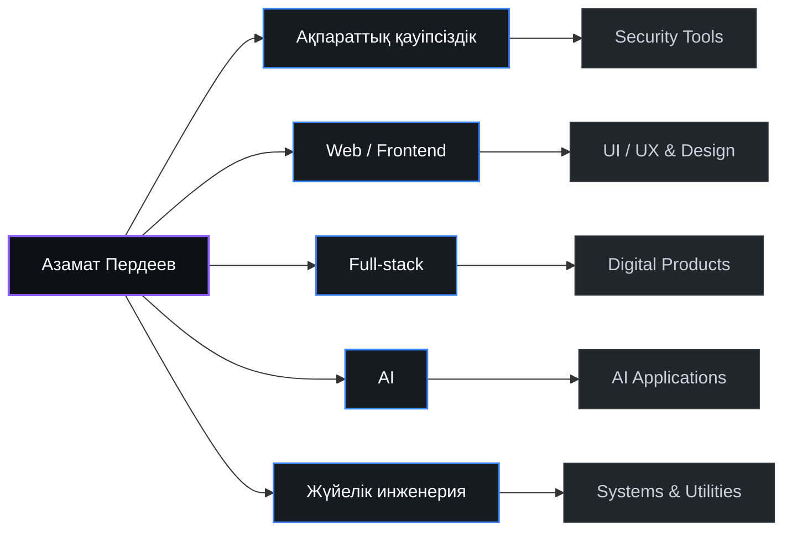

# Азамат Пердеев
### Ақпараттық қауіпсіздік • Web & Full-stack • Жүйелік инженерия • AI

  
  
  

  <b>Қауіпсіздікке, сапалы UI/UX интерфейстерге және нақты пайдаға бағытталған заманауи цифрлық өнімдер жасаймын.</b>

<!-- Жедел навигация -->

  <a href="#-мен-туралы">Мен туралы</a> •
  <a href="#-жұмыс-тәжірибесі">Тәжірибе</a> •
  <a href="#-инженерлік-карта">Инженерлік карта</a> •
  <a href="#-не-жасаймын">Бағыттар</a> •
  <a href="#-негізгі-жобалар">Жобалар</a> •
  <a href="#-технологиялық-стек">Стек</a> •
  <a href="#-дизайн-және-интерфейс">Дизайн</a> •
  <a href="#-білім">Білім</a> •
  <a href="#-байланыс">Байланыс</a>

---

## 👨💻 Мен туралы

Мен — бағдарламалық жасақтама инженерімін және Әбілқас Сағынов атындағы Қарағанды техникалық университетінің Ақпараттық қауіпсіздік бағыты бойынша түлегімін.

Менің кәсіби профилім **«дизайн + код + қауіпсіздік + жасанды интеллект»** тоғысында қалыптасқан. Бір жағынан — Figma-дан бастап React, TypeScript және Tailwind CSS арқылы заманауи, бейімделгіш (responsive) әрі жоғары өнімді web-интерфейстер мен цифрлық платформалар құрастырсам, екінші жағынан — жүйелік деңгейдегі қауіпсіздік құралдарын (honeytokens, фишингке қарсы қорғаныс, client-side құпиялылық) әзірлеймін.

---

## 💼 Жұмыс тәжірибесі

### 🏢 Samga Education
**Web-әзірлеуші / платформа әзірлеушісі** • *03.2026 — 06.2026*

* Білім беру платформасының заманауи web-интерфейсін React, TypeScript және Tailwind CSS арқылы әзірлеу және жетілдіру.
* Кез келген экран өлшеміне бейімделген (responsive) сапалы UI компоненттерін құру.
* REST API интеграциясы және Supabase / PostgreSQL деректер қорымен жұмыс.
* Пайдаланушыларды тіркеу, авторизация және сессияларды қауіпсіз басқару тетіктерін енгізу.
* Clean Code қағидаларын сақтау, өнімділік пен жүктелу жылдамдығын оңтайландыру, тестілеу және release процесіне белсенді қатысу.
* Кросс-функционалды командамен (дизайнерлер, әзірлеушілер, өнім менеджерлері) бірлесе нәтижеге қол жеткізу.

> *«Жұмыс барысында frontend және backend интеграцияларымен жұмыс істесем, жеке жобаларымда осы дағдыларды киберқауіпсіздік, AI және жүйелік бағдарламалау бағыттарында тереңдете қолданамын.»*

---

## 🗺️ Инженерлік карта

---

## 🧩 Не жасаймын?

<table>
  <tr>
    <td width="50%" valign="top">
      <h3>🔐 Қауіпсіздік (Cybersecurity)</h3>
      
Honeytokens (алдамшы тұзақтар), фишингке қарсы интеллектуалды қорғаныс, браузердің сандық ізін жинау және рұқсаттарды шектеу.

      
<b>Жобалар:</b> <a href="#-canary-token-generator">Canary Token Generator</a>, <a href="#-phishguard">PhishGuard</a>

    </td>
    <td width="50%" valign="top">
      <h3>⚙️ Жүйелер (Systems & Utilities)</h3>
      
Windows және Android жүйелерінің төменгі деңгейлі құралдары, SMB желілік ортақ бумалары, NTFS ACL және брандмауэрді автоматтандыру.

      
<b>Жобалар:</b> <a href="#-lan-share-manager">LAN Share Manager</a>, <a href="#-notificationshare">NotificationShare</a>

    </td>
  </tr>
  <tr>
    <td width="50%" valign="top">
      <h3>🤖 Жасанды интеллект (AI & ML)</h3>
      
Мәтіндік қауіптерді талдауға арналған fine-tuned BERT трансформерлері және көпмодельді LLM API маршрутизациясы (DeepSeek, Gemini, Qwen).

      
<b>Жобалар:</b> <a href="#-phishguard">PhishGuard</a>, <a href="#-қазақстанға-арналған-цифрлық-өнімдер">ЗаңКеңес AI</a>

    </td>
    <td width="50%" valign="top">
      <h3>🌐 Web және Құпиялылық (Privacy-First Web)</h3>
      
Деректерді сыртқы серверге жібермей, 100% клиент жағында (in-browser) өңдейтін және нақты аудиторияға арналған платформалар.

      
<b>Жобалар:</b> <a href="#-bank-statement-analyzer">Bank Statement Analyzer</a>, <a href="#-dentflow-kz">DentFlow KZ</a>

    </td>
  </tr>
</table>

---

## 🚀 Негізгі жобалар

### 🛡️ [LAN Share Manager](https://github.com/Azamaperdeev05/lan-share-manager)
Windows жүйесінде SMB желілік ортақ бумаларын баптауға, NTFS рұқсаттары мен брандмауэр ережелерін автоматтандыруға арналған жүйелік утилита.

**Стек:** C# • .NET 8 LTS • WPF • Win32 / PowerShell • GitHub Actions CI

[📦 Репозиторий](https://github.com/Azamaperdeev05/lan-share-manager) • [📖 Нұсқаулық & Құжаттама](https://azamaperdeev05.github.io/lan-share-manager/) • [🚀 Releases](https://github.com/Azamaperdeev05/lan-share-manager/releases)

<b>🔍 Техникалық мәліметтер мен архитектура</b>

* Таза архитектура (Clean Architecture) қағидасымен 5 дербес модульге бөлінген (`Core`, `Infrastructure`, `CLI`, `App`, `Tests`).
* Windows Firewall желілік ережелерін (TCP 445 порты) және жүйелік тілге байланысты жергілікті пайдаланушы құқықтарын автоматты түрде конфигурациялайды.
* Алдын ала қателіктерді тексеретін pre-flight тексеру жүйесі, интерактивті консоль мәзірі және 1 жолдық PowerShell орнатқышы (`irm azamaperdeev05.github.io/lsm | iex`) бар.
* 3 тілді (Қазақша, Орысша, Ағылшынша) толық қолдайды.

---

### 🪤 [Canary Token Generator](https://github.com/Azamaperdeev05/canary-token-generator)
Жүйеге немесе файлдарға рұқсатсыз қол сұғу әрекеттерін ерте анықтайтын self-hosted Honeytoken тұзақ жүйесі.

**Стек:** Go 1.25+ • PostgreSQL 18 • Redis 7 • Docker • Nginx • Cloudflare Tunnel

[📦 Репозиторий](https://github.com/Azamaperdeev05/canary-token-generator)

<b>🔍 Техникалық мәліметтер мен архитектура</b>

* 7 түрлі алдамшы тұзақ құрастырады: `webbug`, `slowredirect`, дайындалған PDF/DOCX файлдары, `.env`, `kubeconfig` және нақты MySQL v10 wire-protocol форматында жауап беретін тұзақ тыңдаушы (listener).
* Тұзақ іске қосылған сәтте шабуылдаушының құрылғы ізін жинайды: Canvas FNV-1a хэші, AudioContext осцилляторы, WebRTC STUN арқылы VPN артындағы жергілікті IP-ді анықтау және экран өлшемдері.
* Асинхронды worker pool, 15 минуттық Redis анти-спам сүзгісі, GeoIP MaxMind ақпараты және HMAC қолтаңбалы Webhook / Telegram хабарламалары бар.

---

### 📧 [PhishGuard](https://github.com/Azamaperdeev05/PhishGuard)
Электрондық хаттар мен сілтемелердегі қауіптерді сараптауға арналған жасанды интеллект негізіндегі фишингке қарсы платформа.

**Стек:** Python 3.10+ • PyTorch • Hugging Face Transformers (BERT) • PySide6 • PostgreSQL • Alembic • Gmail API

[📦 Репозиторий](https://github.com/Azamaperdeev05/PhishGuard)

<b>🔍 Техникалық мәліметтер мен архитектура</b>

* Хат тақырыптарының түпнұсқалығын (SPF, DKIM, DMARC), күдікті URL бағыттарын және хат мәтінін fine-tuned BERT трансформері арқылы тексеретін кешенді pipeline.
* Gmail API (OAuth2) арқылы поштаны қауіпсіз тексеру, қауіпті хаттарға автоматты түрде белгі (label) қою және PDF форматында оқиғалық есептер шығару (ReportLab).
* Деректер базасының көші-қонын басқаратын Alembic, PySide6 графикалық жұмыс үстелі және дербес тестілеу модулі қамтылған.

---

### 📊 [Bank Statement Analyzer](https://github.com/Azamaperdeev05/bank-analizer)
Қазақстан банктерінің PDF үзінді көшірмелерін тікелей браузер жадында, 100% құпиялы түрде талдайтын қаржылық веб-құрал.

**Стек:** JavaScript (ES6+) • PDF.js • Canvas 2D • CSS3 • Vercel

[📦 Репозиторий](https://github.com/Azamaperdeev05/bank-analizer) • [🌐 Тікелей сынап көру](https://bank-analizer-beta.vercel.app)

<b>🔍 Техникалық мәліметтер мен архитектура</b>

* 3 200-ден астам жол таза алгоритмдік JavaScript код арқылы 5 банк үзіндісін өңдейді: Kaspi, Halyk, Forte, Jusan, BCC.
* **Client-side құпиялылық:** Қаржылық деректер мен файлдар ешқандай сыртқы серверге жіберілмейді, барлық есептеу тек жергілікті браузер жадында орындалады.
* Транзакцияларды автоматты түрде санаттарға топтайды, диаграммалар сызады және балансты математикалық тұрғыдан салыстырады.

---

### 🦷 [DentFlow KZ](https://github.com/Azamaperdeev05/dentflow-kz)
Стоматологиялық клиникалардың жұмысын цифрландыруға арналған, рөлдік қауіпсіздік жүйесі енгізілген басқару платформасы.

**Стек:** Next.js 14 • TypeScript • Prisma ORM • NextAuth • SQLite / PostgreSQL • Vitest

[📦 Репозиторий](https://github.com/Azamaperdeev05/dentflow-kz)

<b>🔍 Техникалық мәліметтер мен архитектура</b>

* Рөлдік қолжетімділік (`ADMIN`, `DOCTOR`, `PATIENT`) және TOTP алгоритмімен (QR-код арқылы) екі факторлы аутентификация (2FA).
* Қауіпсіздік журналы (`SecurityAuditLog`) мен күдікті әрекеттерді тіркеу (`LoginRiskSignal`) кестелері арқылы IP және құрылғы белгілерін есепке алу.
* Науқастарды қабылдауға жазу, емдеу жоспары, медициналық файлдарды басқару және хабарлама алмасу жүйесі.

---

### 📱 [NotificationShare](https://github.com/Azamaperdeev05/NotificationShare)
Android құрылғысындағы жүйелік хабарландыруларды сыртқы арналарға сүзгіден өткізіп қайта бағыттайтын ашық қолданба.

**Стек:** Kotlin 1.9 • Jetpack Compose (Material 3) • Android SDK 24+ • Coroutines • WorkManager

[📦 Репозиторий](https://github.com/Azamaperdeev05/NotificationShare)

<b>🔍 Техникалық мәліметтер мен архитектура</b>

* Android `NotificationListenerService` негізінде кілт сөздер арқылы сүзгілеу, қара тізім және WorkManager арқылы қайта жіберу кезегін басқару.
* Хабарландыруларды Telegram, Discord, Slack немесе жеке Webhook арқылы таратады.
* Қолданбаға кіру биометриялық сәйкестендірумен (`BiometricPrompt`) қорғалған, баптаулары шифрланған жадта (`EncryptedSharedPreferences`) сақталады.

---

## 🇰🇿 Қазақстанға арналған цифрлық өнімдер

Отандық пайдаланушылар мен қазақ тілді ортаға арнайы жасалған жобалар:

* **[Сөзділ (Sozdil)](https://github.com/Azamaperdeev05/sozdil):** Қазақ тіліндегі Wordle сөз табу ойыны (4, 5, 6 әріптік режимдер, сөздіктер қоры, Web және Android қосымшасы) • [Веб-сайт](https://sozdil.vercel.app)
* **[ЗаңКеңес AI (zanaikz)](https://github.com/Azamaperdeev05/zanaikz):** ҚР заңнамалық базасына негізделген, көпмодельді AI кеңесшісі • [Веб-сайт](https://zanaikz.vercel.app)
* **[Univer Platonus](https://github.com/Azamaperdeev05/univer.univers):** Қазақстан студенттеріне арналған Platonus порталының жылдам әрі ыңғайлы PWA нұсқасы • [Веб-сайт](https://univerkstu.site)
* **[Tezteru.kz](https://github.com/Azamaperdeev05/tezteru.kz):** Қазақ әліпбиіне арналған пернетақтада жылдам жазуды дамытатын тренажер • [Веб-сайт](https://tezteru-kz.vercel.app)

---

## 🛠️ Технологиялық стек

  

<b>📋 Толық технологиялық стекті көру</b>

 

### Бағдарламалау тілдері
* Go, C# (.NET 8), Python, TypeScript, JavaScript (ES6+), Kotlin, SQL

### Web / Frontend
* React, Next.js, TypeScript, JavaScript, Tailwind CSS, Svelte, HTML5 / CSS3

### UI / UX
* Figma, UI/UX жобалау, Responsive Design, интерактивті прототиптер құру

### Web / No-code
* Tilda, Zero Block
* *WordPress, Webflow — жаңа жобаларға тез меңгеруге және бейімделуге дайын*

### Киберқауіпсіздік
* **Honeytokens / Deception Technology** (алдамшы ресурстар мен тұзақтар)
* **Phishing Detection** (фишингтік шабуылдарды анықтау және сараптау)
* **BERT** (мәтіндік қауіптерді талдауға арналған нейрожелілер)
* **Browser Fingerprinting** (браузердің сандық ізін анықтау)
* **NTFS ACL & Windows Firewall API** (жүйелік рұқсаттар мен желілік ережелерді автоматтандыру)
* **TOTP 2FA** (екі факторлы аутентификация)
* **Security Audit Logging** (қауіпсіздік оқиғаларын тіркеу және қауіп деңгейін бағалау)
* **Client-side Privacy** (деректерді сыртқы серверге жібермей, клиент жағында өңдеу)

### Backend және Инфрақұрылым
* Go net/http, FastAPI, Next.js API Routes, Node.js
* PostgreSQL, SQLite, Redis, Supabase
* Prisma, Alembic
* Docker, Docker Compose, Nginx, GitHub Actions (CI/CD)

### AI (жасанды интеллект)
* PyTorch, Hugging Face Transformers
* DeepSeek, Gemini, Qwen API

### Техникалық жүйелер
* CCTV, IP-камераларды баптау

---

## 🎨 Дизайн және интерфейс

Мен тек функционалды код жазып қана қоймай, пайдаланушыға ыңғайлы, заманауи және визуалды таза өнім жасауға баса назар аударамын:

* **Figma & UI/UX жобалау:** Ақпараттық құрылымды құру, wireframe және интерактивті прототиптеу.
* **Responsive Design:** Смартфон, планшет және үлкен экрандарға 100% бейімделген дизайн жүйелері.
* **Tilda & Zero Block:** Тез арада лендингтер мен маркетингтік беттерді нөлден жинау және стильдеу.
* **Микро-анимациялар мен өнімділік:** Қолданушы тәжірибесін (UX) жақсартатын жеңіл визуалды кері байланыс.

<b>🔄 Жобамен қалай жұмыс істеймін? (8 кезең)</b>

1. **Тапсырманы талдау:** Негізгі талаптарды, мақсатты аудитория мен өнім міндеттерін айқындау.
2. **Прототиптеу:** Негізгі экрандардың сұлбасы мен логикалық құрылымын сызу.
3. **UI/UX жобалау:** Figma ортасында стильдер, типографика және дизайн жүйесін жасау.
4. **Frontend әзірлеу:** React / Next.js / Tailwind CSS арқылы таза әрі модульді код құрастыру.
5. **Бейімдеу:** Барлық браузерлер мен мобильді құрылғыларда мінсіз көрсетілуін қамтамасыз ету.
6. **Интеграциялар:** REST API, деректер базасы және қауіпсіз авторизацияны жалғау.
7. **Тестілеу:** Жүйенің жүктелу жылдамдығын, қауіпсіздігі мен тұрақтылығын тексеру.
8. **Жариялау:** Өнімді серверге орналастыру (deployment), мониторинг және қолдау.

---

## 🎓 Білім

### 🏛️ Әбілқас Сағынов атындағы Қарағанды техникалық университеті
**B058 — Ақпараттық қауіпсіздік**  
*Жоғары білім, бакалавриат • 2026 жылғы түлек*

<b>📚 Қосымша курстар мен сертификаттар</b>

* **Prompt Engineering for ChatGPT** — Coursera & Vanderbilt University *(2025)*
* **Generative AI for Everyone** — Coursera & DeepLearning.AI *(2025)*

---

## 🌐 Тілдер және Жеке қасиеттер

* **Тілдер:** Қазақ тілі — жетік (ана тілі) • Орыс тілі — орташа / жұмыс деңгейі • Ағылшын тілі — A2 / техникалық құжаттама.
* **Негізгі қасиеттерім:** Жүйелі ойлау • Сыни талдау • Жауапкершілік • Бөлшектерге мұқият болу • Жаңа құралдарды тез меңгеру • Дербес және командалық жұмыс.

---

## 📊 GitHub белсенділігі

&nbsp;

---

## 📫 Байланыс

  
  &nbsp;
  
  &nbsp;
  
  &nbsp;
  
  &nbsp;
  

